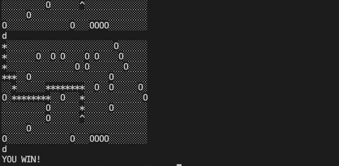

# Welcome to the Find Your Hat Terminal Game

## Starter


## Winner


#### written in node.js
<br/>

### Instructions:
* Take your player path (*) to reach the hat (^).
* Avoid stepping into any holes (0).
* Make sure to stay on the map and avoid falling off.

### Directions:
1. Open up the terminal and type the following command:

```shell
node main.js
```

2. Users are prompted to create their own player field dimensions (Height x Width)

3. Direct your player (*) toward your hat (^) by using L=left, R=Right, U=Up, D=Down

4. If you can reach your hat without stepping into holes, or falling off the map, you win!
